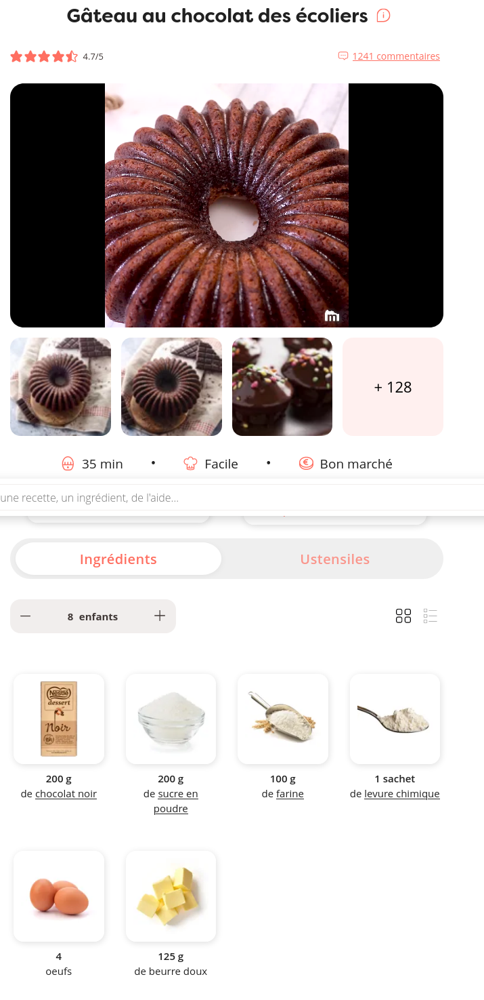
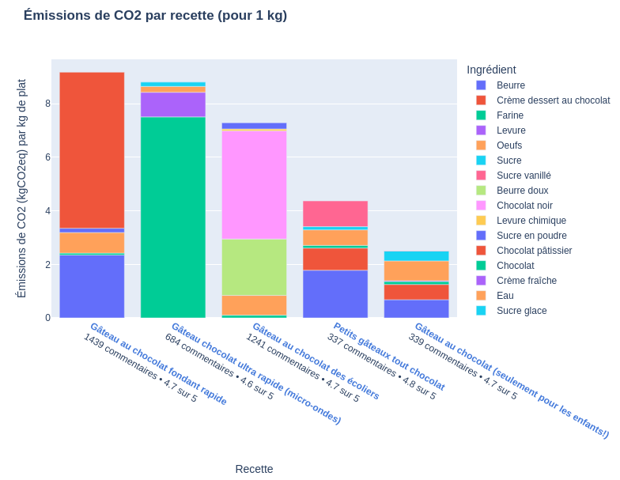
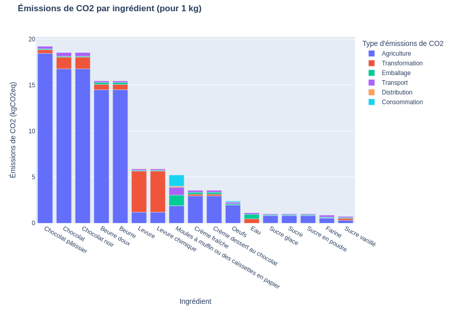

# **Projet Python 2A**
Jean-Baptiste Laval • Sirine Louati • Hadrien Lolivier

*Ce projet est réalisé dans le cadre du cours de Python de Lino Galiana pour l'année 2021-2022.*

Il s'agit d'un programme qui permet de comparer les émissions carbone des recettes d'un plat fourni par l'utilisateur à partir du site Marmiton.


## Installation et utilisation

Dans le notebook **`notebook.ipynb`** se trouvent les instructions détaillées pour installer les éléments requis et pour utiliser le programme.

## Étape 1 : extraction de recettes en scrappant le site Marmiton

### Scrapping

Le scrapper a été codé grâce au module `selenium` et fonctionne avec le browser **`chromedriver`**.

Tout d'abord, il commence par se connecter sur la page d'accueil du site Marmiton et par accepter les cookies s'ils existent. Il lance ensuite une recherche à partir du nom de la recette fourni par l'utilisateur, puis se dirige vers les résultats de recherche et sur les recettes correspondantes.

<div align="center">
  <br>
</div>

Ensuite, à partir de chaque recette, on crée un dictionnaire dont la clé est l'ingrédient et la valeur une liste contenant la quantité et son unité.
Par exemple pour une recette de gâteau au chocolat, on obtient:

``` python
{
    "chocolat noir": [200, "g"],
    "sucre en poudre": [200, "g"],
    "farine": [100, "g"],
    "levure chimique": [1, "sachet"],
    "oeufs": [4],
    "beurre doux": [125, "g"],
}
```


### Interprétation des ingrédients

On peut alors nettoyer le nom de ingrédients, par exemple en enlevant " (+ 10 g pour beurrer le moule)", puis convertir toutes les unités en grammes (par exemple les sachets de levure, le nombre d'oeufs ou encore les autres unités). Pour cela, nous créons des tables de conversion (dans **`conversions.py`** du dossier **`src`**) permettant de convertir le nombre de fruits et de légumes, les paquets, sachets, tasses, verres, cuillères à café, cuillères à soupe etc en grammes. La procédure est la suivante :
- on identifie une quantité (ex : 2), une unité (ex : tasse) et un ingrédient (ex : farine)
- on convertit la quantité en flottant (ex : 1 1/2 --> 1.5)
- si l'unité est dans notre table de conversion en grammes (ex : pincée), alors on la convertit en grammes et on la multiplie par la quantité
- sinon, si l'unité est dans notre table de conversion en millilitres (ex : tasse):
    - si l'ingrédient figure dans notre table de conversion en g / mL (ex : huile) : alors on convertit l'unité en mL et l'ingrédient en g/mL, puis on multiplie ces deux valeurs par la quantité
    - sinon, on cherche la meilleure correspondance pour l'ingrédient dans la table de conversion en g / mL et on applique la même procédure
- sinon, si l'unité est une chaîne vide (ex : dans le cas de "3 pommes") :
    - si l'ingrédient est dans la table de conversion en grammes, on le convertit et on le multiplie par la quantité
    - sinon, on cherche la meilleure correspondance pour l'ingrédient dans la table de conversion en grammes et on applique la même procédure
- sinon, si l'unité est déjà en grammes, on laisse la quantité telle quelle
- sinon, si l'on se trouve dans aucun des cas précédents (ex : "1 boîte moyenne de compote"), alors le programme abandonne le traitement de la recette en cours et signale à l'utilisateur par un `print` l'élément qui n'a pas pu être interprété. Ce cas explique pourquoi le scrapper peut renvoyer moins de résultats que demandés.

Pour les ingrédients qui ne figurent pas dans notre table, nous les associons à l'ingrédient le plus proche selon une distance permettant de comparer la similitude de chaînes de caractères (voir ci-dessous). Nous les affichons également de sorte que l'utilisateur puisse compléter les tables de conversion (une amélioration possible serait d'enrichir automatiquement notre table de conversion au fur et à mesure que nous trouvons un nouvel ingrédient).


### Distance entre deux chaînes de caractères

Afin de comparer deux chaînes de caractères, on commence par les normaliser grâce à la fonction `clean_string` du fichier **`utils.py`**:
- on retire les accents avec le module `unidecode`
- on passe les charactères en minuscules avec la méthode `lower`
- on retire les caractères qui ne sont ni des lettres ni des espaces avec une expression régulière
- on retire les espaces en début et fin de chaîne avec les méthodes `lstrip` et `rstrip`
- on racinise (stemming, en bon français) grâce au `FrenchStemmer` du module `nltk`, notamment pour éviter les problèmes liés au passage au pluriel

Ensuite on calcule la distance entre ces deux chaînes. Pour cela, nous avons testé 4 méthodes différentes, stockées dans le dictionnaire `DIST` défini dans le fichier **`utils.py`** du dossier **`src`**. Afin de mieux les comparer, nous les avons normalisées de sorte qu'elles vaillent toutes 0 lorsque deux chaînes sont très proches et 1 lorsqu'elles sont très différentes. On identifie chaque méthode avec un trigramme. Les 4 méthodes sont :
- **Gestalt Pattern Matching (GPM)**, implémentée par le module `difflib` : consiste à comparer la longueur de la séquence commune maximale aux deux chaines de caractères aux longueurs des deux chaînes
- **Partial Levenshtein distance (FWZ)**, implémentée par le module `fuzzywuzzy` : cacule la distance de Levenshtein entre la chaîne la plus courte et tous les sous-chaînes de la chaîne la plus longue de même longueur que la chaîne la plus courte, et ensuite prend le minimum de toutes ces valeurs.
- **Standard Levenshtein distance (LEV)**, implémentée par le module `nltk` : nombre minimal d'opérations parmi un ajout, une suppression ou un remplacement permettant de transformer une chaîne en l'autre
- **une distance personnalisée (PER)**, que nous avons nous-mêmes conçue et dont nous détaillons le principe ci-dessous.

Pour deux chaînes de caractères données, la distance PER fonctionne en deux temps : d'abord elle identifie la similitude globale des deux chaînes en leur attribuant un intervalle de valeurs d'amplitude 0.2, puis elle affine au sein de chaque intervalle. Les différents cas sont les suivants :
- **0.0 :** les chaînes de caractères sont identiques
- **de 0.0 à 0.2 :** une chaîne de caractères commence par l'autre (ex : "chocolat noir" et "chocolat noir à 40%"). La distance est affinée en comparant les longueurs respectives des deux chaînes.
- **de 0.2 à 0.4 :** une chaîne de caractères commence par le ou les premier(s) mot(s) de l'autre (ex : "chocolat noir" et "chocolat au lait"). La distance est affinée en comparant la longueur de la chaîne de caractère commune à gauche et celle de la plus longue chaîne.
- **de 0.4 à 0.6 :** une chaîne de caractères contient l'intégralité de l'autre chaîne mais pas dès le début (ex : "chocolat noir" et "tablette de chocolat noir fourrée"). La distance est affinée en comparant la longueur de la sous-chaîne précédent l'occurence de la chaîne la plus courte au sein de la chaîne la plus longue, à la la longueur de la plus longue chaîne.
- **de 0.6 à 0.8 :** une chaîne de caractères contient les premiers mots de l'autre (ex : "chocolat noir" et "tablette de chocolat au lait"). La distance est affinée par la distance GPM.
- **de 0.8 à 1.0 :** les autres cas possibles. La distance est affinée par la distance standard de Levenshtein.

La fonction `compare_methods` permettant de visualiser les différentes performances des différentes méthodes est présentée dans le notebook. La méthode qui donne généralement les meilleurs résultats est la méthode PER.

### Sortie du scrapper

Nous complétons le dictionnaire des ingrédients par le nom de la recette, le nombre de commentaires, la note moyenne, le nombre de portions et l'URL pour obtenir par exemple le dictionnaire suivant :

``` python
{
    "Gâteau au chocolat fondant rapide": {
        "ingredients": {
            "chocolat pâtissier": 200.0,
            "farine": 50.0,
            "sucre en poudre": 100.0,
            "beurre": 100.0,
            "oeufs": 210.0,
        },
        "nb_people": 6,
        "nb_comments": 1437,
        "mark": 4.7,
        "url": "https://www.marmiton.org/recettes/recette_gateau-au-chocolat-fondant-rapide_166352.aspx",
    },
    "Gâteau au chocolat des écoliers": {
        "ingredients": {
            "chocolat noir": 200.0,
            "sucre en poudre": 200.0,
            "farine": 100.0,
            "levure chimique": 11.0,
            "oeufs": 280.0,
            "beurre doux": 125.0,
        },
        "nb_people": 8,
        "nb_comments": 1240,
        "mark": 4.7,
        "url": "https://www.marmiton.org/recettes/recette_gateau-au-chocolat-des-ecoliers_20654.aspx",
    }
}
```

## Étape 2 : identification des ingrédients et calcul de leur empreinte carbone grâce à la base Agribalyse

Nous commençons par importer la base de données à partir du site [Agribalyse]("https://koumoul.com/s/data-fair/api/v1/datasets/agribalyse-detail-etape/raw").

Ensuite, nous sélectionnons les colonnes qui nous intéressent et les renommons pour faciliter leur traitement ultérieur. Nous procédons également au nettoyage des noms des ingrédients afin de les rendre les plus proches possible de ceux de la première partie, toujours avec la fonction `clean_string`.

Par la suite, la fonction `match_products` du fichier **`food2emissions.py`** du dossier **`src`** permet de renvoyer les noms d'ingrédients de la base de données les plus proches de notre ingrédient initial.

Finalement, nous retournons l'estimation d'émission carbone d'un produit à partir de celle du produit de la base Agribalyse qui lui correspond le mieux.

## Étape 3 : agrégation des données

Cette étape consiste simplement à agréger les sources de données entre elles. À ce stade, les données sont réparties en 3 dataframes que la phrase d'agrégation fusionne (`merge`), nettoie (`rename`, `drop`) et fond (`melt`). Ces 3 dataframes sont :

- `products_data` : c'est le dataframe obtenu à l'import des données d'Agribalyse (voir étape 2).

- `recipes` : c'est le dataframe obtenu en convertissant le dictionnaire renvoyé par le scrapper en dataframe (voir étape 1).

- `ingredients` : permet d'améliorer l'estimation de l'empreinte carbone des ingrédients, nous en détaillons le principe ci-dessous.

### Principe de la table `ingredients`

Le principe s'appuie sur l'idée que les ingrédients tendent à se retrouver dans plusieurs recettes pour le même plat. Or, dans chacune de ces recettes, un même ingrédient peut être désigné différemment, certaines dénominations permettant un meilleur matching que d'autres dans la base d'Agribalyse.

Nous essayons alors de trouver, pour chaque ingrédient, s'il existe un ingrédient dans une autre recette qui en soit suffisamment proche, et qui permette un meilleur matching dans la base d'Agribalyse. Si c'est le cas, alors on considère que les deux ingrédients sont le même.

Par exemple, en cherchant les recettes de gâteau au chocolat, une recette utilise du "sucre en poudre" alors qu'une autre utilise du "sucre". D'une part, le meilleur match dans la base d'Agribalyse pour "sucre en poudre" est "sucre vanillé" (distance de 0.218182). D'autre part, le meilleur match pour "sucre" est "sucre roux" (distance de 0.111111). Enfin, la distance entre "sucre" et "sucre en poudre" est de 0.133333.

Donc "sucre en poudre" est plus proche de "sucre" que de son meilleur match dans la base d'Agribalyse. De plus, "sucre" est plus proche de son meilleur match que "sucre en poudre" du sien. Ainsi, nous considérerons désormais que le "sucre en poudre" est assimilable au "sucre" et le ferons correspondre au "sucre roux" dans la base d'Agribalyse plutôt qu'au "sucre vanillé".

C'est cette information que contient le dataframe `ingredients`.

## Étape 4 : affichage synthétisé des résultats

Tout d'abord, il s'agit de mettre en forme la dataframe contenant les données agrégées, de sorte à le rendre plus lisible et présentable : on renomme les colonnes en français et en format plus compréhensible, on rajoute des majuscules et les unités corrspondantes, on arrondit les valeurs, en ayant pris soin de rapporter au préalable les grandeurs extensives à 1 kg de plat.

Par la suite, nous implémentons les deux fonctions primordiales de cette dernière partie, dans le fichier **`interface.py`** du dossier **`src`** :

- la fonction `compare_recipes` permet de renvoyer un premier histogramme où chaque colonne correspond à une recette du plat en question,

<div align="center">
  <br>
</div>

- la fonction `compare_ingredients` permet de renvoyer un second histogramme où chauqe colonne correspond à un ingrédient parmi tous les ingrédients confondus de toutes les recettes.

<div align="center">
  <br>
</div>


Le premier histogramme permet de rendre compte des recettes les plus carbonées et les moins carbonées. Parfois, l'utilisateur pourra s'étonner qu'une recette soit très carbonée à cause d'un ingrédient en particulier, sans comprendre pourquoi celui-ci est lui-même très carboné. Pour cela, le second histogramme permet d'expliquer ce point et de comprendre les différents postes d'émissions de chaque ingrédient.

La dernière fonction `interface` permet de fusionner les deux histogrammes dans le fichier **`interface.html`** généré automatiquement dans le dossier **`data`**. Sur la page html, en passant la souris sur chaque recette, on peut visualiser chaque ingrédient qui la compose avec des informations complémentaires :
- le nom de la recette
- le nombre de commentaires
- la note attribuée sur le site Marmiton
- la masse de l'ingrédient nécessaire pour préparer 1 kg de plat
- la contribution carbone associée à l'ingrédient pour 1 kg de plat
- les émissions carbone de l'ingrédient par kg d'ingrédient
- la meilleure correspondance avec la base Agribalyse
- le dregré de fiabilité de cette correspondance
- la qualité des données (Data Quality Ratio = DQR) associée au produit en question dans la base d'Agribalyse.

Par ailleurs, en cliquant sur le nom de chaque recette en bas du premier histogramme, cela permet de se rendre directement vers la page de la recette en question sur le site Marmiton. De plus, en cliquant sur les ingrédients dans la légende de l'histogramme, on peut choisir des les afficher ou de les cacher, ce qui permet de comparer les recettes par exemple en ignorant un ingrédient.

En parcourant le deuxième histogramme à la souris, on obtient également des informations complémentaires, notamment la valeur des postes d'émission carbone de chaque ingrédient.
